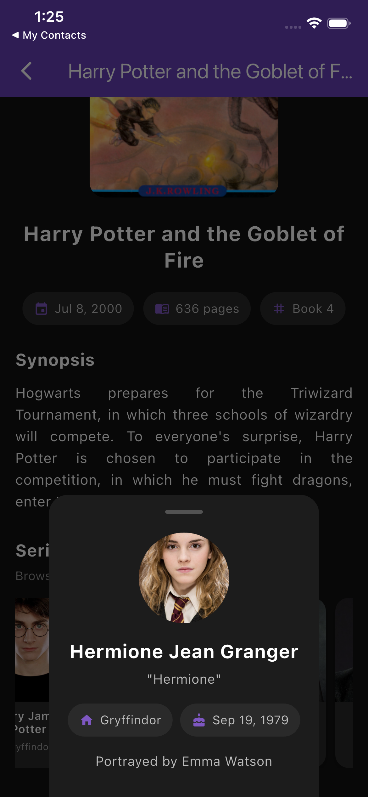

# Harry Potter Books

Flutter app for browsing Harry Potter books and series characters via the public [PotterAPI](https://github.com/fedeperin/potterapi).

**Started:** October 14, 2025

## Screenshots

<table>
  <tr>
    <td align="center" width="50%">
      <br />
      <sub>Home</sub>
    </td>
    <td align="center" width="50%">
      <br />
      <sub>Book details</sub>
    </td>
  </tr>
  <tr>
    <td align="center" width="50%">
      <br />
      <sub>Characters</sub>
    </td>
    <td align="center" width="50%">
      <br />
      <sub>Character sheet</sub>
    </td>
  </tr>
</table>

## Features

- Browse all Harry Potter books in a responsive grid
- Open a book for cover, release date, page count, and synopsis
- Explore series characters with house and actor details
- Loading, empty, and error states with retry
- Pull to refresh on the books list

## Tech stack

- Flutter / Dart 3
- Dio for networking
- Cubit (`flutter_bloc`) for state management

## Architecture

Small and intentional — no over-engineering:

| Layer | Role |
| --- | --- |
| `models/` | Typed `Book` and `Character` models |
| `services/` | Dio-based `ApiService` with timeouts and clear errors |
| `cubit/` | `BooksCubit` and `CharactersCubit` for UI state |
| `screens/` | Home grid and book details |
| `widgets/` | Reusable cards, network image, and status views |
| `theme/` | Shared dark purple theme |

## Getting started

```bash
flutter pub get
flutter run
```

## Verify

```bash
flutter analyze
flutter test
```

## API

- Base URL: `https://potterapi-fedeperin.vercel.app/en`
- Endpoints used: `/books`, `/characters`
